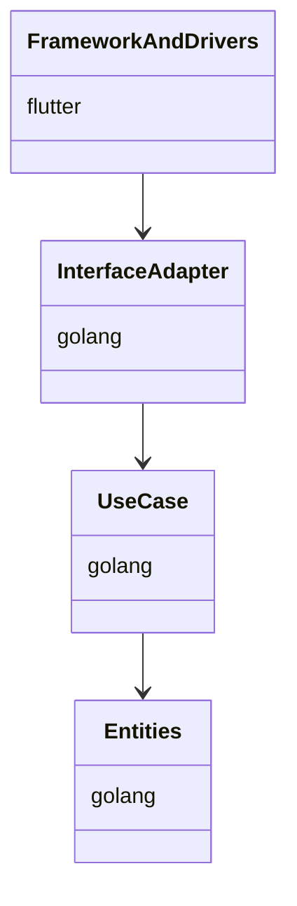

# FluMinGo

---

## 名前について
[Flu]tter : フロントエンドをクロスプラットフォームを採用
[Min]imam : 開発者のコーディング量を最小限にすることを目指す
[Go]lang  : バックエンドはパフォーマンスに優れたgolangを採用

---

## 用途

本アプリは業務用アプリケーション用の開発フレームワークである。
flutterによるクロスプラットフォーム対応、golangによるマイクロサービスの構成により拡張性と保守性の向上を目指す。

---

## 技術スタック

| 層 | 要素 | 備考 |
|--- | --- |--- |
| フロントエンド | Flutter | MVC |
| バックエンド | golang | マイクロサービス、クリーンアーキテクチャ |
| データベース(本体メモリ) | sqlite | ORM使用 |
| データベース(メイン) | postgres | ORM使用 |
| 通信プロトコル | http3(quic) | |

---

## レイヤー図



---

## ディレクトリ構成

### Flutter

```plaintext
lib/
├── screens/
│   ├── login/
│   │   ├── model/
│   │   ├── controller/
│   │   └── view/
│   └── home/
│       ├── model/
│       ├── controller/
│       └── view/
├── util/
│   ├── component/
│   │   ├── textbox/
│   │   ├── button/
│   │   ├── label/
│   │   ├── table/
│   │   ├── modal/
│   │   └── snakbar/
│   ├── http/
│   ├── sqlite/
│   └── http3/
├── services/
│   ├── api_service.dart
│   └── auth_service.dart
├── models/
│   ├── user_model.dart
│   └── product_model.dart
├── providers/
│   └── auth_provider.dart
├── routes/
│   └── app_routes.dart
└── main.dart
```

### golang(共通機能-API)

```plaintext
common/
├── api/
│   ├── handler/
│   │   └── api_handler.go
│   ├── middleware/
│   │   └── auth_middleware.go
│   └── service/
│       └── api_service.go
├── config/
│   └── config.go
├── logger/
│   └── logger.go
├── util/
│   ├── util.go
│   └── helper.go
└── database/
    ├── db.go
    ├── migration.go
    └── orm.go
```

### golang(個別API_interface and adapter)

```plaintext
microservice/
└── service_name/
    ├── handler/
    │   └── service_handler.go
    ├── middleware/
    │   └── service_middleware.go
    ├── service/
    │   └── service.go
    ├── repository/
    │   └── repository.go
    └── dto/
        └── dto.go
```

### golang(個別API_use case)

```plaintext
microservice/
└── service_name/
    └── usecase/
        └── usecase.go
```

### golang(個別API_entities)

```plaintext
microservice/
└── service_name/
    └── entity/
        └── entity.go