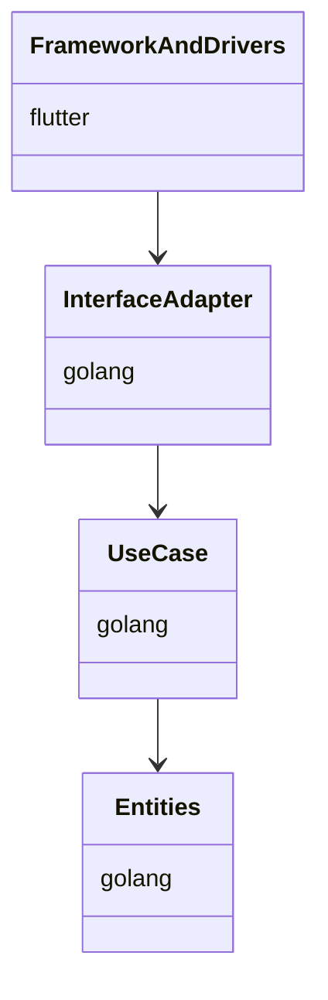
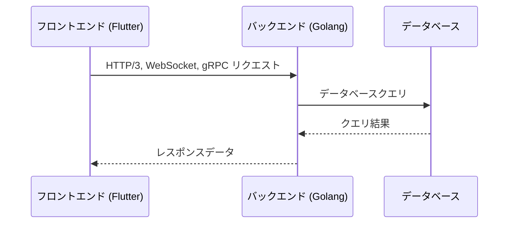

# FluMinGo

---

## 名前について
[Flu]tter : フロントエンドをクロスプラットフォームを採用  
[Min]imam : 開発者のコーディング量を最小限にすることを目指す  
[Go]lang  : バックエンドはパフォーマンスに優れたgolangを採用  

---

## 用途

本アプリは業務用アプリケーション用の開発フレームワークである。
flutterによるクロスプラットフォーム対応、golangによるマイクロサービスの構成により拡張性と保守性の向上を目指す。

---

## 技術スタック

| 層 | 要素 | 備考 |
|--- | --- |--- |
| フロントエンド | Flutter | MVC、Provider、Dio |
| バックエンド | golang | マイクロサービス、クリーンアーキテクチャ、GORM |
| データベース(本体メモリ) | sqlite | ORM使用、軽量データストレージ |
| データベース(メイン) | postgres | ORM使用、高可用性 |
| 通信プロトコル | http3(quic), WebSocket, gRPC | 高速通信、リアルタイム通信、高性能RPC |
| デザイン | グラスモーフィズム | モダンUIデザイン |

---

## コーディング規約

各コードの１行ごとに対し日本語でコメントを記載すること。  
関数やクラスの定義には詳細なドキュメントコメントを追加すること。

---

## レイヤー図



---

## ディレクトリ構成

### Flutter

```plaintext
flutter_app/lib/
├── screens/                # 各画面のディレクトリ
│   ├── login/              # ログイン画面
│   │   ├── model/          # ログイン画面のモデル
│   │   │   └── login_model.dart
│   │   ├── controller/     # ログイン画面のコントローラー
│   │   │   └── login_controller.dart
│   │   └── view/           # ログイン画面のビュー
│   │       └── login_view.dart
│   └── home/               # ホーム画面
│       ├── model/          # ホーム画面のモデル
│       │   └── home_model.dart
│       ├── controller/     # ホーム画面のコントローラー
│       │   └── home_controller.dart
│       └── view/           # ホーム画面のビュー
│           └── home_view.dart
│   └── profile/            # プロフィール画面
│       ├── model/          # プロフィール画面のモデル
│       │   └── profile_model.dart
│       ├── controller/     # プロフィール画面のコントローラー
│       │   └── profile_controller.dart
│       └── view/           # プロフィール画面のビュー
│           └── profile_view.dart
├── util/                   # ユーティリティクラス
│   ├── component/          # UIコンポーネント
│   │   ├── textbox.dart
│   │   ├── button.dart
│   │   ├── label.dart
│   │   ├── table.dart
│   │   ├── modal.dart      // モーダルダイアログ
│   │   ├── snackbar.dart   // スナックバー
│   │   ├── dropdown.dart   // ドロップダウン
│   │   ├── slider.dart     // スライダー
│   │   ├── switch.dart     // スイッチ
│   │   ├── progress_bar.dart // プログレスバー
│   │   ├── card.dart       // カード
│   │   ├── list.dart       // リスト
│   │   ├── grid.dart
│   │   ├── tooltip.dart
│   │   ├── badge.dart
│   │   ├── avatar.dart
│   │   ├── carousel.dart
│   │   ├── stepper.dart
│   │   ├── timeline.dart
│   │   └── rating.dart
│   │   ├── accordion.dart
│   │   ├── spinner.dart
│   │   ├── pagination.dart
│   │   ├── breadcrumb.dart
│   │   ├── tabs.dart
│   │   ├── alert.dart
│   │   ├── toast.dart
│   │   ├── badge.dart
│   │   ├── chip.dart
│   │   ├── divider.dart
│   │   ├── expansion_panel.dart
│   │   ├── progress_indicator.dart
│   │   ├── rating_bar.dart
│   │   ├── search_bar.dart
│   │   ├── slider.dart
│   │   ├── stepper.dart
│   │   ├── switch.dart
│   │   ├── tooltip.dart
│   │   ├── tree.dart
│   │   └── wizard.dart
│   │   ├── app_bar.dart
│   │   ├── bottom_navigation_bar.dart
│   │   ├── drawer.dart
│   │   ├── floating_action_button.dart
│   │   ├── grid_view.dart
│   │   ├── list_view.dart
│   │   ├── navigation_rail.dart
│   │   ├── refresh_indicator.dart
│   │   ├── scaffold.dart
│   │   ├── tab_bar.dart
│   │   ├── tab_view.dart
│   │   ├── tooltip.dart
│   │   ├── tree_view.dart
│   │   └── wizard_view.dart
│   ├── http/               # HTTPクライアント
│   │   └── http_client.dart
│   ├── sqlite/             # SQLiteヘルパー
│   │   └── sqlite_helper.dart
│   ├── websocket/          # WebSocketクライアント
│   │   └── websocket_client.dart
│   ├── grpc/               # gRPCクライアント
│   │   └── grpc_client.dart
│   ├── validation/         # バリデーションヘルパー
│   │   └── validation_helper.dart
│   ├── encryption/         # 暗号化ヘルパー
│   │   └── encryption_helper.dart
│   ├── base_page/          # ベースページ
│   │   ├── base_page.dart
│   │   └── base_page_helper.dart
│   ├── logging/            # ロギングヘルパー
│   │   └── logging_helper.dart
│   ├── error_handling/     # エラーハンドリング
│   │   └── error_handler.dart
│   ├── localization/       # ローカライゼーションヘルパー
│   │   └── localization_helper.dart
│   ├── theme/              # テーマヘルパー
│   │   └── theme_helper.dart
│   ├── analytics/          # アナリティクスヘルパー
│   │   └── analytics_helper.dart
│   ├── cache/              # キャッシュヘルパー
│   │   └── cache_helper.dart
│   ├── date/               # 日付ヘルパー
│   │   └── date_helper.dart
│   ├── file/               # ファイルヘルパー
│   │   └── file_helper.dart
│   ├── network/            # ネットワークヘルパー
│   │   └── network_helper.dart
│   ├── notification/       # 通知ヘルパー
│   │   └── notification_helper.dart
│   ├── permission/         # 権限ヘルパー
│   │   └── permission_helper.dart
│   ├── storage/            # ストレージヘルパー
│   │   └── storage_helper.dart
│   ├── user/               # ユーザーヘルパー
│   │   └── user_helper.dart
│   ├── math/               # 数学ヘルパー
│   │   └── math_helper.dart
│   ├── string/             # 文字列ヘルパー
│   │   └── string_helper.dart
│   ├── json/               # JSONヘルパー
│   │   └── json_helper.dart
│   ├── xml/                # XMLヘルパー
│   │   └── xml_helper.dart
│   ├── form/               # フォームヘルパー
│   │   └── form_helper.dart
│   ├── navigation/         # ナビゲーションヘルパー
│   │   └── navigation_helper.dart
│   └── dialog/             # ダイアログヘルパー
│       └── dialog_helper.dart
├── services/               # サービスクラス
│   ├── api_service.dart
│   └── auth_service.dart
├── models/                 # データモデル
│   ├── user_model.dart
│   └── product_model.dart
├── providers/              # プロバイダー
│   └── auth_provider.dart
├── routes/                 # ルート定義
│   └── app_routes.dart
└── main.dart               # エントリーポイント
```

### golang(共通機能-API)

```plaintext
golang/fw/
├── api/                    # API関連
│   ├── handler/            # ハンドラー
│   │   └── api_handler.go
│   ├── middleware/         # ミドルウェア
│   │   └── auth_middleware.go
│   └── service/            # サービス
│       └── api_service.go
├── config/                 # 設定
│   └── config.go
├── logger/                 # ロガー
│   └── logger.go
├── util/                   # ユーティリティ
│   ├── util.go
│   ├── helper.go
│   ├── validation.go
│   └── encryption.go
├── websocket/              # WebSocket関連
│   ├── handler/            # ハンドラー
│   │   └── websocket_handler.go
│   ├── middleware/         # ミドルウェア
│   │   └── websocket_middleware.go
│   └── service/            # サービス
│       └── websocket_service.go
├── grpc/                   # gRPC関連
│   ├── handler/            # ハンドラー
│   │   └── grpc_handler.go
│   ├── middleware/         # ミドルウェア
│   │   └── grpc_middleware.go
│   └── service/            # サービス
│       └── grpc_service.go
└── database/               # データベース関連
    ├── db.go
    ├── migration.go
    └── orm.go
```

### golang(個別API_interface and adapter)

```plaintext
golang/microservice/
└── service_name/           # サービス名
    ├── handler/            # ハンドラー
    │   └── service_handler.go
    ├── middleware/         # ミドルウェア
    │   └── service_middleware.go
    ├── service/            # サービス
    │   └── service.go
    ├── repository/         # リポジトリ
    │   └── repository.go
    └── dto/                # データ転送オブジェクト
        └── dto.go
```

### golang(個別API_use case)

```plaintext
golang/microservice/
└── service_name/
    └── usecase/            # ユースケース
        └── usecase.go
```

### golang(個別API_entities)

```plaintext
golang/microservice/
└── service_name/
    └── entity/             # エンティティ
        └── entity.go
```

---

## フロントエンドとバックエンドの通信

フロントエンド（Flutter）とバックエンド（Golang）は、以下の通信プロトコルを使用してデータをやり取りします。

### HTTP/3 (QUIC)
- 主にRESTful APIのエンドポイントを通じてデータを取得・送信します。
- 高速で信頼性の高い通信を実現します。

### WebSocket
- リアルタイム通信が必要な場合に使用します。
- 例：チャットアプリケーションやリアルタイム通知。

### gRPC
- 高性能なRPC（Remote Procedure Call）を実現します。
- バイナリプロトコルを使用するため、効率的なデータ転送が可能です。

### 認証と認可
- フロントエンドからバックエンドへのリクエストは、JWT（JSON Web Token）を使用して認証されます。
- 各リクエストには適切な認可が必要です。

### エラーハンドリング
- フロントエンドは、バックエンドからのエラーレスポンスを適切に処理します。
- 共通のエラーハンドリングメカニズムを実装します。

### データフォーマット
- データはJSON形式で送受信されます。
- 必要に応じて、プロトコルバッファ（Protocol Buffers）を使用してデータをシリアライズします。

#### JSONの使用ケース
- RESTful APIのエンドポイントでのデータ送受信。
- フロントエンドとバックエンド間の一般的なデータ交換。
- 人間が読みやすい形式が必要な場合。

#### プロトコルバッファの使用ケース
- gRPC通信でのデータ送受信。
- マイクロサービス館での通信に使用する。
- 高性能かつ効率的なデータ転送が必要な場合。
- バイナリ形式でのデータシリアライズが求められる場合。

フロントエンドからバックエンドへのリクエストは、適切な認証と認可を経て処理されます。バックエンドは、各種サービスやデータベースと連携し、必要なデータをフロントエンドに返します。



---

## セットアップ手順

### 前提条件
- Flutter SDK
- Golang
- PostgreSQL

### 手順
1. リポジトリをクローンします。
    ```bash
    git clone https://github.com/your-repo/FluMinGo.git
    cd FluMinGo
    ```
2. 必要な依存関係をインストールします。
    ```bash
    flutter pub get
    go mod tidy
    ```
3. データベースをセットアップします。
    ```bash
    psql -U postgres -c "CREATE DATABASE flumingo;"
    ```

---

## 依存関係

### フロントエンド
- Flutter
- Provider
- Dio

### バックエンド
- Golang
- GORM

---

## テスト方法

### フロントエンド
```bash
flutter test
```

### バックエンド
```bash
go test ./...
```

---

## デプロイ手順

### フロントエンド
1. ビルドを実行します。
    ```bash
    flutter build apk
    ```

### バックエンド
1. バイナリをビルドします。
    ```bash
    go build -o flumingo
    ```

---
