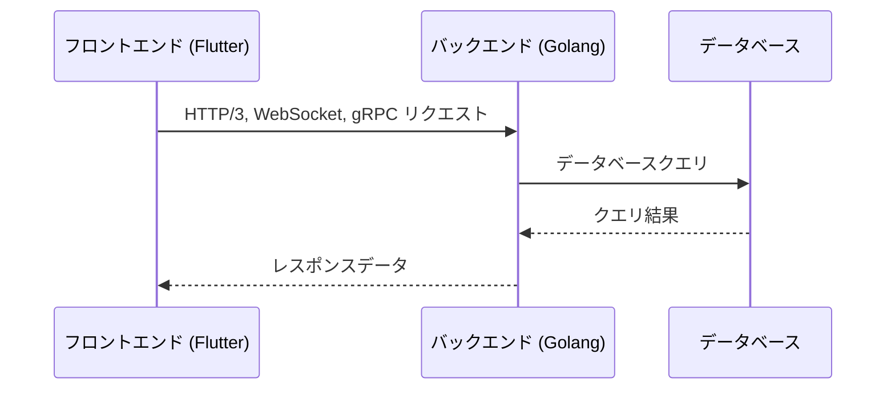

# フロントエンドとバックエンドの通信

フロントエンド（Flutter）とバックエンド（Golang）は、以下の通信プロトコルを使用してデータをやり取りします。

### HTTP/3 (QUIC)
- 主にRESTful APIのエンドポイントを通じてデータを取得・送信します。
- 高速で信頼性の高い通信を実現します。

### WebSocket
- リアルタイム通信が必要な場合に使用します。
- 例：チャットアプリケーションやリアルタイム通知。

### gRPC
- 高性能なRPC（Remote Procedure Call）を実現します。
- バイナリプロトコルを使用するため、効率的なデータ転送が可能です。

### 認証と認可
- フロントエンドからバックエンドへのリクエストは、JWT（JSON Web Token）を使用して認証されます。
- 各リクエストには適切な認可が必要です。

### エラーハンドリング
- フロントエンドは、バックエンドからのエラーレスポンスを適切に処理します。
- 共通のエラーハンドリングメカニズムを実装します。

### データフォーマット
- データはJSON形式で送受信されます。
- 必要に応じて、プロトコルバッファ（Protocol Buffers）を使用してデータをシリアライズします。

#### JSONの使用ケース
- RESTful APIのエンドポイントでのデータ送受信。
- フロントエンドとバックエンド間の一般的なデータ交換。
- 人間が読みやすい形式が必要な場合。

#### プロトコルバッファの使用ケース
- gRPC通信でのデータ送受信。
- マイクロサービス館での通信に使用する。
- 高性能かつ効率的なデータ転送が必要な場合。
- バイナリ形式でのデータシリアライズが求められる場合。

フロントエンドからバックエンドへのリクエストは、適切な認証と認可を経て処理されます。バックエンドは、各種サービスやデータベースと連携し、必要なデータをフロントエンドに返します。

