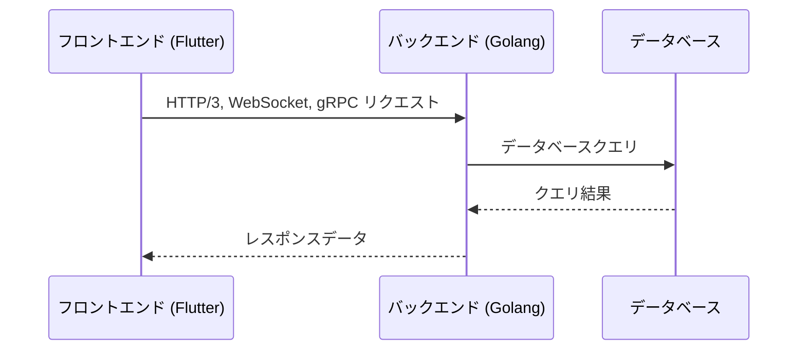

# フロントエンドとバックエンドの通信

## 目次
1. [通信方式一覧](#1-通信方式一覧)
2. [認証と認可](#2-認証と認可)
3. [エラーハンドリング](#3-エラーハンドリング)
4. [データフォーマット](#4-データフォーマット)
5. [セキュリティ対策](#5-セキュリティ対策)
6. [補足: 各プロトコルの高度な利用ケース](#6-補足-各プロトコルの高度な利用ケース)
7. [APIのバージョン管理](#7-apiのバージョン管理)
8. [APIドキュメントの管理](#8-apiドキュメントの管理)

## 1. 通信方式一覧
| 通信方式   | 特徴                                      | 利用例                                                     |
|------------|-----------------------------------------|------------------------------------------------------------|
| HTTP/3    | 高速接続確立、UDPベース、パケットロス耐性  | ユーザー情報取得、低待機認証情報取得                         |
| WebSocket | 双方向通信、低レイテンシ                   | チャット、リアルタイム通知                                    |
| gRPC      | バイナリプロトコル、効率的なデータ転送      | マイクロサービス間の大量データ伝送、分散計算                  |

## 2. 認証と認可
- **方法**：  
  - JWTを使用した認証とリフレッシュトークン管理
- **具体例**：  
  - ログイン時のJWT発行、失効リスト管理

## 3. エラーハンドリング
- **方法**：  
  - 共通エラーハンドリングメカニズムの実装  
  - エラーコード・メッセージの標準化
- **注意点**：  
  - ユーザーへ適切なフィードバック、再試行機構の実装

## 4. データフォーマット
- **JSON**：  
  - 人間可読、RESTful API向け
- **プロトコルバッファ**：  
  - バイナリ形式で高速・効率的なデータシリアライズ

## 5. セキュリティ対策
- HTTPS、JWT、CSRF対策、入力値検証、セキュリティヘッダーの設定などを実施  
- **具体例**：  
  - フォーム入力データのサニタイズ、SQLインジェクション防止

各プロトコルは、低レイテンシ、エラーハンドリング、セキュリティ面での最適化が行われています。  
具体的には、HTTP/3はUDPベースの高速ハンドシェイクを実現し、WebSocketは双方向通信の即時性を、gRPCはバイナリプロトコルによる通信効率の向上を担保します。  
また、JWT認証により各リクエストの信頼性を確保し、定期的なセキュリティレビューと更新によって最新の脅威に対応する設計です。

## 6. 補足: 各プロトコルの高度な利用ケース
通信プロトコルは、パフォーマンス、信頼性、及びセキュリティの観点から最適なものを選択します。各技術の内部動作やトラフィック解析ツールを用いたモニタリングも導入してください。

フロントエンドからバックエンドへのリクエストは、適切な認証と認可を経て処理されます。バックエンドは、各種サービスやデータベースと連携し、必要なデータをフロントエンドに返します。



## 7. APIのバージョン管理
- **バージョン管理の重要性**：APIの変更が既存のクライアントに影響を与えないように、バージョン管理を行います。
- **バージョニングの方法**：URLパスにバージョン番号を含める（例：`/api/v1/resource`）などの方法を採用します。
- **互換性の維持**：新しいバージョンをリリースする際には、旧バージョンとの互換性を維持し、段階的な移行をサポートします。

## 8. APIドキュメントの管理
- **Swagger**：Swaggerを使用して、APIドキュメントを自動生成します。
- **OpenAPI**：OpenAPI仕様に基づいて、APIドキュメントを管理します。
- **ドキュメントの公開**：APIドキュメントを公開し、開発者が参照できるようにします。

### Swaggerの設定例
```yaml
swagger: "2.0"
info:
  description: "FluMinGo API Documentation"
  version: "1.0.0"
  title: "FluMinGo API"
host: "api.flumingo.com"
basePath: "/v1"
schemes:
- "https"
paths:
  /users:
    get:
      summary: "Get all users"
      responses:
        200:
          description: "A list of users"
          schema:
            type: "array"
            items:
              $ref: "#/definitions/User"
definitions:
  User:
    type: "object"
    properties:
      id:
        type: "integer"
      name:
        type: "string"
      email:
        type: "string"
```
