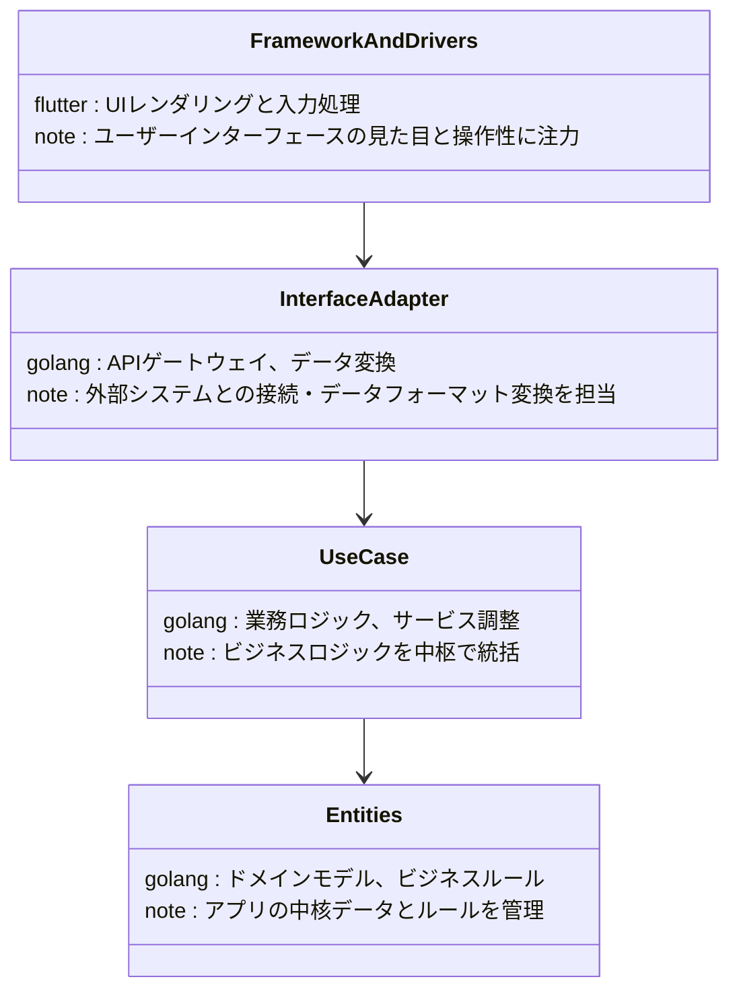

# レイヤー図

## 目次
1. [レイヤー図](#1-レイヤー図)
2. [補足: 各層の役割と設計思想](#2-補足-各層の役割と設計思想)

## 1. レイヤー図

以下は、アプリケーションアーキテクチャの分割と依存性制御を示す一例です。  

## 2. 補足: 各層の役割と設計思想

| レイヤー              | 主な担当内容                              | 特徴                           |
|-----------------------|-----------------------------------------|--------------------------------|
| FrameworkAndDrivers   | UIレンダリング、入力処理                  | ユーザーインターフェース重視    |
| InterfaceAdapter      | APIゲートウェイ、データ変換               | 外部システムとの連携            |
| UseCase               | 業務ロジック、サービス調整               | 中枢でビジネスロジック統括       |
| Entities              | ドメインモデル、ビジネスルール           | アプリの中核データ管理          |

- **明確なインターフェース定義**：各層間の契約を明示
- **エラーハンドリングの一元管理**：例外処理が統一的に実装
- **依存性逆転の原則**：柔軟なモジュール交換と拡張を実現

詳細な設計パターンや実装例は内部ドキュメントを参照してください。

## 3. 各層の具体的な技術スタック
| レイヤー              | 技術スタック                              |
|-----------------------|-----------------------------------------|
| FrameworkAndDrivers   | Flutter, HTTP/3, WebSocket, gRPC        |
| InterfaceAdapter      | Golang, REST API, GraphQL               |
| UseCase               | Golang, Business Logic                  |
| Entities              | Golang, Domain Models                   |

## 4. 各層のテスト戦略
| レイヤー              | テスト戦略                              |
|-----------------------|-----------------------------------------|
| FrameworkAndDrivers   | ユニットテスト、UIテスト                |
| InterfaceAdapter      | インテグレーションテスト、APIテスト      |
| UseCase               | ユニットテスト、サービステスト          |
| Entities              | ユニットテスト、ドメインテスト          |

- **ユニットテスト**：各モジュールの単体機能をテスト
- **インテグレーションテスト**：モジュール間の連携をテスト
- **UIテスト**：ユーザーインターフェースの動作をテスト
- **APIテスト**：APIエンドポイントの動作をテスト
- **サービステスト**：ビジネスロジックの動作をテスト
- **ドメインテスト**：ドメインモデルの動作をテスト
