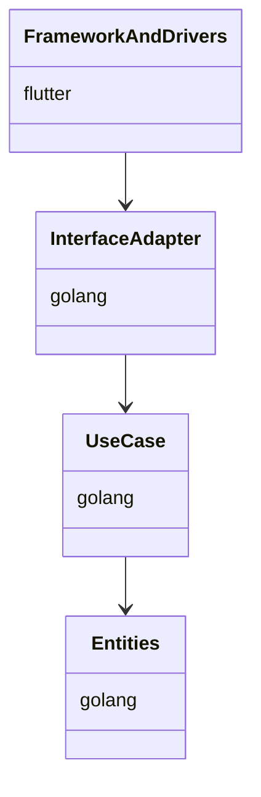

# レイヤー図

```mermaid
classDiagram
    direction TB
    class FrameworkAndDrivers {
        flutter
    }
    class InterfaceAdapter {
        golang
    }
    class UseCase {
        golang
    }
    class Entities {
        golang
    }
    FrameworkAndDrivers --> InterfaceAdapter
    InterfaceAdapter --> UseCase
    UseCase --> Entities
```
