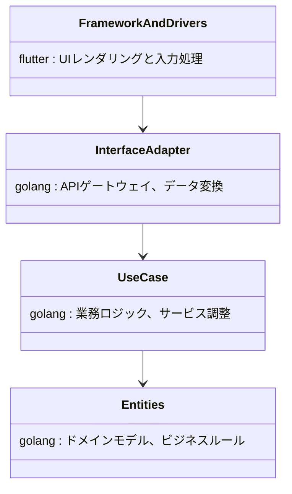

# レイヤー図

以下のレイヤー図は、アプリケーションアーキテクチャの高度な分割と依存性制御の一例です。
各層はSOLID原則やクリーンアーキテクチャの観点から設計されています。

```mermaid
classDiagram
    direction TB
    class FrameworkAndDrivers {
        flutter : UIレンダリングと入力処理
    }
    class InterfaceAdapter {
        golang : APIゲートウェイ、データ変換
    }
    class UseCase {
        golang : 業務ロジック、サービス調整
    }
    class Entities {
        golang : ドメインモデル、ビジネスルール
    }
    FrameworkAndDrivers --> InterfaceAdapter
    InterfaceAdapter --> UseCase
    UseCase --> Entities
```

<!-- 補足: 各層の役割と設計思想 -->
各層は疎結合を維持し、高い拡張性とテスト容易性を実現するために設計されています。
